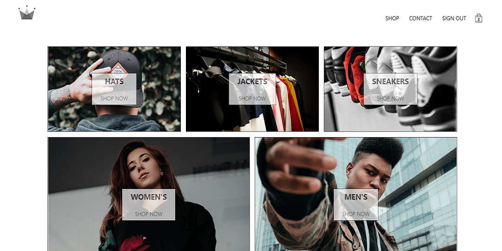

# CRWN Clothing

> A demo shopping web app built using React - [Visit the Web App (on Desktop)](https://crwn-clothing-react.azurewebsites.net)

## Table of Content

1. [Requirements](#what-you-can-do)

2. [Usage](#project-learnings)

3. [Future Works](#future-works)

4. [Credits](#credits)

5. [Send Me Queries or Feedback](#send-me-queries-or-feedback)

6. [License](#license)

## What you can do

1. Sign Up / Sign In using email address and password or google account.

2. Explore Hats, Jackets, and Sneakers for Women and Men.

3. Add items to cart

4. Add/ Remove items from checkout page

5. Pay using Stripe's test Visa card

## Project Learnings

1. React for Component based development

2. Handling states and props using Redux

3. React Routers for simple and nested routing

4. Using middlewares conditionally using process.env.NODE_ENV

5. Creating selectors and handling updates in global store with minimum re-rendering

6. Integrating firebase auth and using Google OAuth from firebase for Sign up and Sign in

7. Using firebase firestore to store user data

8. Setting up CI/CD for deploying the React app to Azure App Services from GitHub using Azure DevOps Pipelines

9. Configuring web.config for handling client-side and server-side routings for the React App

## Future Works

-   [ ] Responsive for mobile devices

-   [ ] Clear cart after successful payment

-   [ ] Storing product information on a server

-   [ ] Upgrading Stripe legacy version to a newer one

## Credits

1. This project is a part of [Complete React Developer in 2021 (w/ Redux, Hooks, GraphQL)](https://www.udemy.com/course/complete-react-developer-zero-to-mastery/) course on Udemy by [Andrei Neagoie](https://github.com/aneagoie) and [Yihua Zhang](https://github.com/ZhangMYihua)

2. I created the CI/CD pipeline on Azure DevOps after watching [this video](https://youtu.be/aMO-NQ1Xza0) on YouTube which is not up to date but gives a clear idea on what to do

3. Deploying a React App can be frustrating sometimes due to the client-routing errors, but the [official create-react-app documentation](https://create-react-app.dev/docs/deployment/) can make it a piece of cake

## Send Me Queries or Feedback

It is a small project for learning react, but you can contact me if you...

1. ...have some valuable inputs to share
2. ...want to work on it
3. ...find any bug
4. ...want to share a feedback on the work
5. ...etc.

Send me a mail at [tejasmorkar@gmail.com](tejasmorkar@gmail.com) or [create a new Issue](https://github.com/tejasmorkar/crwn-clothing/issues/new) on this repository.
You can also contact me through my [LinkedIn Profile](https://www.linkedin.com/in/tejasmorkar/).

## License

This project is freely available for free non-commercial/ commercial use, and may be redistributed under these conditions. Please, see the [license](./LICENSE) for further details.
